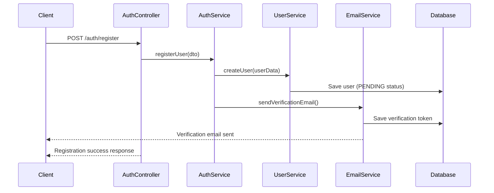
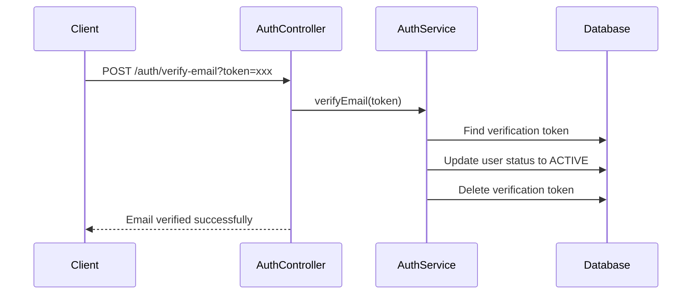
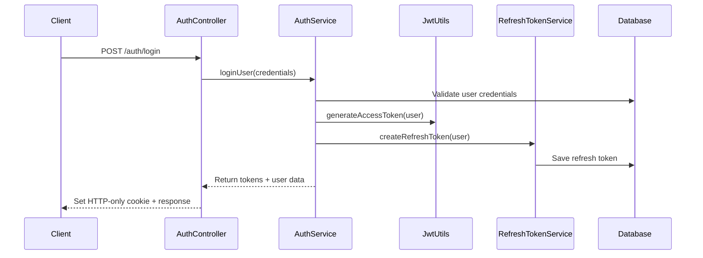
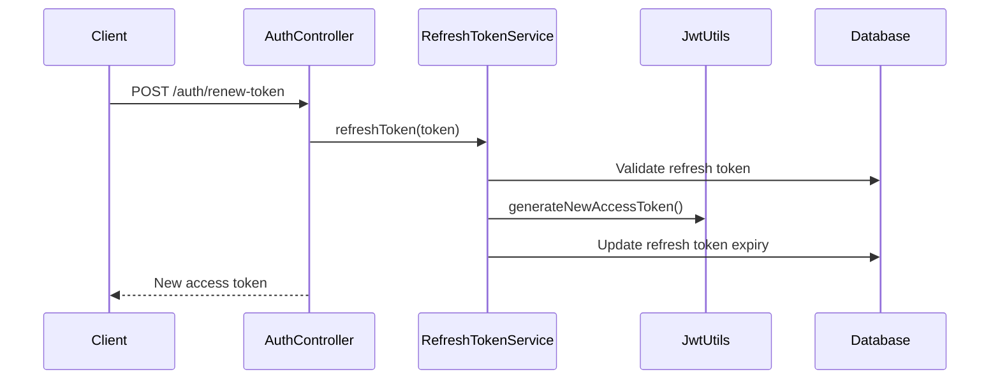

# Kaleidoscope Authentication System Documentation

## Overview
The Kaleidoscope authentication system is built using Spring Security with JWT (JSON Web Tokens) and implements a comprehensive security architecture with refresh tokens, email verification, and role-based access control.

## Architecture Components

### Core Technologies
- **Spring Security 6.x**: Main security framework
- **JWT (JSON Web Tokens)**: Stateless authentication
- **BCrypt**: Password hashing
- **HTTP-only Cookies**: Secure token storage
- **Email Verification**: Account activation system
- **Refresh Tokens**: Token renewal mechanism

### Key Components Structure

```
auth/
├── config/
│   ├── CorsConfig.java              # Cross-Origin Resource Sharing configuration
│   ├── JwtProperties.java           # JWT configuration properties
│   └── SecurityConfig.java          # Main security configuration
├── controller/
│   ├── AuthController.java          # Authentication REST endpoints
│   └── AuthViewController.java      # View-based auth endpoints
├── dto/
│   ├── request/                     # Request DTOs for auth operations
│   └── response/                    # Response DTOs for auth operations
├── exception/
│   ├── AuthExceptionHandler.java    # Centralized auth exception handling
│   ├── auth/                        # Auth-specific exceptions
│   ├── email/                       # Email verification exceptions
│   └── token/                       # Token-related exceptions
├── model/
│   ├── EmailVerification.java       # Email verification entity
│   └── RefreshToken.java           # Refresh token entity
├── repository/
│   ├── EmailVerificationRepository.java
│   └── RefreshTokenRepository.java
├── security/
│   ├── CustomAccessDeniedHandler.java
│   ├── filter/                      # Security filters
│   └── jwt/                         # JWT utilities and filters
├── service/
│   ├── AuthService.java            # Main authentication service
│   ├── EmailService.java           # Email verification service
│   ├── RefreshTokenService.java    # Refresh token management
│   ├── UserRegistrationService.java # User registration logic
│   └── impl/                        # Service implementations
└── routes/
    └── AuthRoutes.java             # Route constants
```

## Authentication Flow

### 1. User Registration Flow


### 2. Email Verification Flow


### 3. Login Flow


### 4. Token Refresh Flow


## Security Configuration

### HTTP Security Configuration
The `SecurityConfig` class configures:

1. **CORS**: Cross-origin requests handling
2. **CSRF**: Disabled for stateless API
3. **Session Management**: Stateless (no server-side sessions)
4. **Authentication Entry Point**: Custom JWT error handling
5. **Access Denied Handler**: Custom access denied responses

### Protected vs Public Endpoints

**Public Endpoints** (No authentication required):
- `POST /auth/register` - User registration
- `POST /auth/login` - User login
- `POST /auth/verify-email` - Email verification
- `POST /auth/forgot-password` - Password reset request
- `POST /auth/reset-password` - Password reset
- `POST /auth/renew-token` - Token refresh
- `GET /auth/check-username` - Username availability
- API documentation endpoints (`/api-docs/**`, `/swagger-ui/**`)
- Health check endpoints (`/actuator/health`)

**Protected Endpoints** (Authentication required):
- All other endpoints require valid JWT token
- Role-based access control applied based on user roles

### Filter Chain Order
1. **CorrelationIdFilter**: Adds correlation ID for request tracking
2. **AuthTokenFilter**: JWT token validation and authentication
3. **UsernamePasswordAuthenticationFilter**: Spring Security default

## JWT Token System

### Access Tokens
- **Purpose**: API authentication
- **Storage**: Memory/Local storage on client
- **Expiration**: Short-lived (configurable, typically 15-30 minutes)
- **Claims**: User ID, username, roles, expiration

### Refresh Tokens
- **Purpose**: Renewing expired access tokens
- **Storage**: HTTP-only secure cookies
- **Expiration**: Long-lived (configurable, typically 7-30 days)
- **Database**: Stored in `refresh_tokens` table
- **Security**: Single-use or limited-use tokens

### Token Structure
```json
{
  "sub": "user123",
  "username": "john.doe",
  "roles": ["USER"],
  "iat": 1640995200,
  "exp": 1641001200
}
```

## Password Security

### Password Hashing
- **Algorithm**: BCrypt with configurable strength
- **Salt**: Automatically generated per password
- **Storage**: Hashed passwords stored in database

### Password Reset Flow
1. User requests password reset with email
2. System generates secure verification token
3. Email sent with reset link containing token
4. User clicks link and provides new password
5. Token validated and password updated
6. All existing refresh tokens invalidated

## Email Verification System

### Verification Process
1. **Registration**: User account created with `PENDING` status
2. **Token Generation**: Unique verification token created
3. **Email Sending**: Verification email with token link
4. **Verification**: Token validation activates account
5. **Cleanup**: Expired tokens automatically removed

### EmailVerification Entity
```java
@Entity
public class EmailVerification {
    private Long id;
    private String token;          // Unique verification token
    private Instant expiry;        // Token expiration time
    private User user;             // Associated user
}
```

## Exception Handling

### Custom Exception Types
- **AuthenticationException**: Invalid credentials
- **JwtTokenExpiredException**: Expired JWT tokens
- **EmailVerificationException**: Email verification issues
- **RefreshTokenException**: Refresh token problems

### Global Exception Handler
The `AuthExceptionHandler` provides centralized handling of authentication-related exceptions with appropriate HTTP status codes and error messages.

## Security Best Practices Implemented

### 1. Token Security
- JWT tokens are stateless and self-contained
- Refresh tokens stored securely in HTTP-only cookies
- Token expiration times configured appropriately
- Refresh token rotation on use (optional)

### 2. Password Security
- Strong password hashing with BCrypt
- Password complexity requirements (configurable)
- Secure password reset flow with time-limited tokens

### 3. Session Security
- Stateless authentication (no server-side sessions)
- CSRF protection disabled (appropriate for stateless APIs)
- Secure cookie configuration for refresh tokens

### 4. Error Handling
- Generic error messages to prevent information leakage
- Proper HTTP status codes for different scenarios
- Detailed logging for security monitoring

### 5. CORS Configuration
- Configurable CORS policies
- Specific allowed origins, methods, and headers
- Credential support for authenticated requests

## Configuration Properties

### JWT Configuration (`JwtProperties`)
```yaml
kaleidoscope:
  jwt:
    secret: ${JWT_SECRET}
    access-token-expiration: 900000      # 15 minutes
    refresh-token-expiration: 604800000  # 7 days
```

### Email Configuration
```yaml
spring:
  mail:
    host: ${SMTP_HOST}
    port: ${SMTP_PORT}
    username: ${SMTP_USERNAME}
    password: ${SMTP_PASSWORD}
```

## API Endpoints Reference

### Authentication Endpoints
- `POST /auth/register` - User registration
- `POST /auth/login` - User login
- `POST /auth/logout` - User logout
- `POST /auth/renew-token` - Refresh access token

### Password Management
- `POST /auth/forgot-password` - Request password reset
- `POST /auth/reset-password` - Reset password with token
- `POST /auth/change-password` - Change password (authenticated)

### Email Verification
- `POST /auth/verify-email` - Verify email with token
- `POST /auth/resend-verification` - Resend verification email

### Utility Endpoints
- `GET /auth/check-username` - Check username availability

## Monitoring and Logging

### Security Events Logged
- Login attempts (successful/failed)
- Password reset requests
- Email verification attempts
- Token refresh operations
- Access denied events

### Correlation ID
- Each request gets a unique correlation ID
- Enables tracing of requests across services
- Included in all log entries for debugging

## Testing with Bruno HTTP Client

The authentication system can be tested using the Bruno HTTP client with the test collection located in `/Kaleidoscope-api-test/auth/`. This includes tests for:
- User registration and verification
- Login and logout flows
- Token refresh operations
- Password reset functionality
- Username availability checks

## Future Enhancements

### Planned Features
- Multi-factor authentication (MFA)
- OAuth2 integration (Google, GitHub)
- Rate limiting for authentication endpoints
- Advanced session management
- Audit logging for security events

### Security Improvements
- Token blacklisting for logout
- Device fingerprinting
- Suspicious activity detection
- Geographic login restrictions
