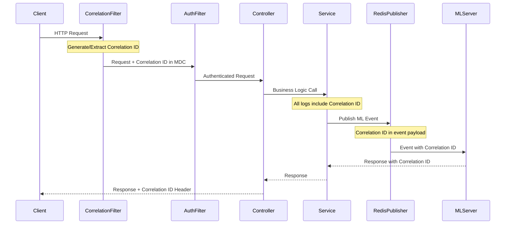

# Kaleidoscope Logging System with ELK Stack Integration

## Overview
The Kaleidoscope backend implements a comprehensive logging system using the ELK Stack (Elasticsearch, Logstash, Kibana) with correlation IDs for request tracing. The architecture follows the pipeline: **Spring Boot Logging → Logstash → Elasticsearch → Kibana** for centralized log management, processing, and visualization.

## Architecture Components

### Core Technologies
- **Spring Boot Logging Framework**: Logback with SLF4J
- **Correlation ID Filter**: Request tracking across services
- **Logstash**: Log aggregation, processing, and transformation
- **Elasticsearch**: Centralized log storage and indexing
- **Kibana**: Log visualization and dashboard creation
- **Docker**: Containerized ELK stack infrastructure

### Complete Logging Architecture

```
┌─────────────────┐    ┌──────────────────┐    ┌─────────────────────┐
│   Client        │    │   Backend API    │    │   ML Server         │
│   Request       │───▶│   + Correlation  │───▶│   + Correlation     │
└─────────────────┘    │   ID Filter      │    │   ID Propagation    │
                       └──────────────────┘    └─────────────────────┘
                                │                          │
                                ▼                          ▼
                       ┌──────────────────┐    ┌─────────────────────┐
                       │   Spring Boot    │    │   Redis Streams     │
                       │   Logback        │    │   Event Logs        │
                       │   (JSON Format)  │    │   (Correlation ID)  │
                       └──────────────────┘    └─────────────────────┘
                                │                          │
                                ▼                          │
                       ┌──────────────────┐                │
                       │   Logstash       │◀───────────────┘
                       │   Processing     │
                       │   & Parsing      │
                       └──────────────────┘
                                │
                                ▼
                       ┌──────────────────┐
                       │   Elasticsearch  │
                       │   Index Storage  │
                       │   & Search       │
                       └──────────────────┘
                                │
                                ▼
                       ┌──────────────────┐
                       │   Kibana         │
                       │   Dashboards &   │
                       │   Visualization  │
                       └──────────────────┘
```

## Spring Boot Logging Configuration

### Logback Configuration (logback-spring.xml)
Complete logging configuration for ELK stack integration:

```xml
<configuration>
    <include resource="org/springframework/boot/logging/logback/defaults.xml"/>
    
    <!-- Console Appender for Development -->
    <appender name="CONSOLE" class="ch.qos.logback.core.ConsoleAppender">
        <encoder class="net.logstash.logback.encoder.LogstashEncoder">
            <includeContext>true</includeContext>
            <includeMdc>true</includeMdc>
            <customFields>{"service":"kaleidoscope-backend"}</customFields>
            <fieldNames>
                <timestamp>@timestamp</timestamp>
                <message>message</message>
                <level>level</level>
                <thread>thread_name</thread>
                <logger>logger_name</logger>
            </fieldNames>
        </encoder>
    </appender>
    
    <!-- File Appender for Logstash Consumption -->
    <appender name="FILE" class="ch.qos.logback.core.rolling.RollingFileAppender">
        <file>logs/kaleidoscope.log</file>
        <rollingPolicy class="ch.qos.logback.core.rolling.SizeAndTimeBasedRollingPolicy">
            <fileNamePattern>logs/archived/kaleidoscope.%d{yyyy-MM-dd}.%i.log</fileNamePattern>
            <maxFileSize>100MB</maxFileSize>
            <maxHistory>30</maxHistory>
            <totalSizeCap>3GB</totalSizeCap>
        </rollingPolicy>
        <encoder class="net.logstash.logback.encoder.LogstashEncoder">
            <includeContext>true</includeContext>
            <includeMdc>true</includeMdc>
            <customFields>{"service":"kaleidoscope-backend","environment":"${SPRING_PROFILES_ACTIVE:-development}"}</customFields>
        </encoder>
    </appender>
    
    <!-- Logstash TCP Appender (Direct to Logstash) -->
    <appender name="LOGSTASH" class="net.logstash.logback.appender.LogstashTcpSocketAppender">
        <destination>${LOGSTASH_HOST:-localhost}:${LOGSTASH_PORT:-5000}</destination>
        <encoder class="net.logstash.logback.encoder.LogstashEncoder">
            <includeContext>true</includeContext>
            <includeMdc>true</includeMdc>
            <customFields>{"service":"kaleidoscope-backend"}</customFields>
        </encoder>
        <connectionStrategy>
            <roundRobin>
                <connectionTTL>5 minutes</connectionTTL>
            </roundRobin>
        </connectionStrategy>
    </appender>
    
    <!-- Async Appender for Performance -->
    <appender name="ASYNC" class="ch.qos.logback.classic.AsyncAppender">
        <queueSize>512</queueSize>
        <discardingThreshold>0</discardingThreshold>
        <includeCallerData>false</includeCallerData>
        <appender-ref ref="LOGSTASH"/>
    </appender>
    
    <!-- Root Logger Configuration -->
    <root level="INFO">
        <appender-ref ref="CONSOLE"/>
        <appender-ref ref="FILE"/>
        <appender-ref ref="ASYNC"/>
    </root>
    
    <!-- Application Specific Loggers -->
    <logger name="com.kaleidoscope.backend" level="DEBUG" additivity="false">
        <appender-ref ref="CONSOLE"/>
        <appender-ref ref="FILE"/>
        <appender-ref ref="ASYNC"/>
    </logger>
    
    <!-- Spring Framework Loggers -->
    <logger name="org.springframework.web" level="INFO"/>
    <logger name="org.springframework.security" level="INFO"/>
    <logger name="org.springframework.data.redis" level="INFO"/>
    
    <!-- Database Loggers -->
    <logger name="org.hibernate.SQL" level="DEBUG"/>
    <logger name="org.hibernate.type.descriptor.sql.BasicBinder" level="TRACE"/>
</configuration>
```

### Spring Boot Dependencies (pom.xml)
Required dependencies for ELK stack integration:

```xml
<dependencies>
    <!-- Spring Boot Starter Web (includes Logback) -->
    <dependency>
        <groupId>org.springframework.boot</groupId>
        <artifactId>spring-boot-starter-web</artifactId>
    </dependency>
    
    <!-- Logstash Logback Encoder -->
    <dependency>
        <groupId>net.logstash.logback</groupId>
        <artifactId>logstash-logback-encoder</artifactId>
        <version>7.4</version>
    </dependency>
    
    <!-- SLF4J API (included in Spring Boot) -->
    <dependency>
        <groupId>org.slf4j</groupId>
        <artifactId>slf4j-api</artifactId>
    </dependency>
</dependencies>
```

## Correlation ID Implementation

### CorrelationIdFilter
The correlation ID filter is the first filter in the Spring Security chain, ensuring every request gets a unique tracking identifier:

```java
@Component
@Slf4j
public class CorrelationIdFilter extends OncePerRequestFilter {
    
    private static final String CORRELATION_ID_HEADER = "X-Correlation-ID";
    private static final String CORRELATION_ID_MDC_KEY = "correlationId";
    
    @Override
    protected void doFilterInternal(HttpServletRequest request, 
                                  HttpServletResponse response, 
                                  FilterChain filterChain) throws ServletException, IOException {
        
        // Extract correlation ID from header or generate new one
        String correlationId = extractOrGenerateCorrelationId(request);
        
        // Add to MDC for logging
        MDC.put(CORRELATION_ID_MDC_KEY, correlationId);
        
        // Add to response header
        response.addHeader(CORRELATION_ID_HEADER, correlationId);
        
        try {
            filterChain.doFilter(request, response);
        } finally {
            // Clean up MDC to prevent memory leaks
            MDC.clear();
        }
    }
    
    private String extractOrGenerateCorrelationId(HttpServletRequest request) {
        String correlationId = request.getHeader(CORRELATION_ID_HEADER);
        return correlationId != null ? correlationId : UUID.randomUUID().toString();
    }
}
```

### Security Filter Chain Integration
The correlation ID filter is positioned as the first filter in the security chain:

```java
@Configuration
@EnableWebSecurity
public class SecurityConfig {
    
    @Bean
    public SecurityFilterChain securityFilterChain(HttpSecurity http, 
                                                  CorrelationIdFilter correlationIdFilter,
                                                  AuthTokenFilter authTokenFilter) throws Exception {
        return http
            // Add CorrelationIdFilter before SecurityContextHolderFilter
            .addFilterBefore(correlationIdFilter, SecurityContextHolderFilter.class)
            // Add AuthTokenFilter before UsernamePasswordAuthenticationFilter
            .addFilterBefore(authTokenFilter, UsernamePasswordAuthenticationFilter.class)
            .build();
    }
}
```

## ELK Stack Configuration

### Docker Compose ELK Stack Setup
Complete docker-compose configuration with ELK stack:

```yaml
services:
  # Existing services (db, redis, app)...
  
  elasticsearch:
    image: docker.elastic.co/elasticsearch/elasticsearch:8.15.0
    container_name: kaleidoscope-elasticsearch
    environment:
      - node.name=kaleidoscope-es
      - cluster.name=kaleidoscope-cluster
      - discovery.type=single-node
      - bootstrap.memory_lock=true
      - "ES_JAVA_OPTS=-Xms512m -Xmx512m"
      - xpack.security.enabled=false
      - xpack.security.enrollment.enabled=false
    ulimits:
      memlock:
        soft: -1
        hard: -1
    volumes:
      - elasticsearch_data:/usr/share/elasticsearch/data
    ports:
      - "9200:9200"
      - "9300:9300"
    networks:
      - app-network
    healthcheck:
      test: ["CMD-SHELL", "curl -f http://localhost:9200/_cluster/health || exit 1"]
      interval: 30s
      timeout: 10s
      retries: 5
    deploy:
      resources:
        limits:
          cpus: '1.0'
          memory: 1G
    restart: unless-stopped

  logstash:
    image: docker.elastic.co/logstash/logstash:8.15.0
    container_name: kaleidoscope-logstash
    volumes:
      - ./logstash.conf:/usr/share/logstash/pipeline/logstash.conf
      - ./logs:/usr/share/logstash/logs
    ports:
      - "5000:5000"  # TCP input for direct log shipping
      - "5044:5044"  # Beats input
      - "9600:9600"  # API endpoint
    environment:
      - "LS_JAVA_OPTS=-Xmx512m -Xms512m"
      - ELASTICSEARCH_HOSTS=http://elasticsearch:9200
    networks:
      - app-network
    depends_on:
      elasticsearch:
        condition: service_healthy
    deploy:
      resources:
        limits:
          cpus: '0.5'
          memory: 768M
    restart: unless-stopped

  kibana:
    image: docker.elastic.co/kibana/kibana:8.15.0
    container_name: kaleidoscope-kibana
    environment:
      - ELASTICSEARCH_HOSTS=http://elasticsearch:9200
      - SERVER_NAME=kaleidoscope-kibana
      - SERVER_HOST=0.0.0.0
    ports:
      - "5601:5601"
    networks:
      - app-network
    depends_on:
      elasticsearch:
        condition: service_healthy
    deploy:
      resources:
        limits:
          cpus: '0.5'
          memory: 512M
    restart: unless-stopped

  # Update app service to include ELK integration
  app:
    # ...existing configuration...
    environment:
      - LOGSTASH_HOST=logstash
      - LOGSTASH_PORT=5000
      - ELASTICSEARCH_HOST=elasticsearch
      - ELASTICSEARCH_PORT=9200
    depends_on:
      - db
      - redis
      - elasticsearch
      - logstash

volumes:
  elasticsearch_data:
    driver: local
  # ...existing volumes...

networks:
  app-network:
    driver: bridge
```

### Logstash Configuration (logstash.conf)
Complete Logstash pipeline configuration:

```ruby
input {
  # TCP input for direct log shipping from Spring Boot
  tcp {
    port => 5000
    codec => json_lines
    tags => ["spring-boot-direct"]
  }
  
  # File input for log files (backup method)
  file {
    path => "/usr/share/logstash/logs/kaleidoscope.log"
    start_position => "beginning"
    sincedb_path => "/dev/null"
    codec => json
    tags => ["spring-boot-file"]
  }
  
  # Beats input for future Filebeat integration
  beats {
    port => 5044
    tags => ["beats"]
  }
}

filter {
  # Parse Spring Boot logs if they're not already JSON
  if "spring-boot" in [tags] {
    if [message] =~ /^\d{4}-\d{2}-\d{2}/ {
      grok {
        match => { 
          "message" => "%{TIMESTAMP_ISO8601:timestamp} %{LOGLEVEL:level} %{NUMBER:pid} --- \[%{DATA:thread}\] %{DATA:logger} : %{GREEDYDATA:log_message}" 
        }
      }
      
      date {
        match => [ "timestamp", "yyyy-MM-dd HH:mm:ss.SSS" ]
      }
    }
  }
  
  # Enhance correlation ID tracking
  if [correlationId] {
    mutate {
      add_field => { "trace_id" => "%{correlationId}" }
    }
  }
  
  # Parse user information if available in MDC
  if [mdc][userId] {
    mutate {
      add_field => { "user_id" => "%{[mdc][userId]}" }
    }
  }
  
  if [mdc][username] {
    mutate {
      add_field => { "username" => "%{[mdc][username]}" }
    }
  }
  
  # Add service metadata
  mutate {
    add_field => { 
      "service_name" => "kaleidoscope-backend"
      "environment" => "${ENVIRONMENT:development}"
    }
  }
  
  # Parse stack traces for errors
  if [level] == "ERROR" and [message] {
    mutate {
      add_tag => [ "error" ]
    }
  }
  
  # Categorize logs by logger name
  if [logger_name] {
    if [logger_name] =~ /auth/ {
      mutate { add_tag => [ "authentication" ] }
    } else if [logger_name] =~ /posts/ {
      mutate { add_tag => [ "posts" ] }
    } else if [logger_name] =~ /users/ {
      mutate { add_tag => [ "users" ] }
    } else if [logger_name] =~ /ml/ {
      mutate { add_tag => [ "machine-learning" ] }
    }
  }
  
  # Remove sensitive data (optional)
  mutate {
    remove_field => [ "host", "path" ]
  }
}

output {
  # Main Elasticsearch output
  elasticsearch {
    hosts => ["${ELASTICSEARCH_HOSTS:elasticsearch:9200}"]
    index => "kaleidoscope-logs-%{+YYYY.MM.dd}"
    template_name => "kaleidoscope-logs"
    template => {
      "index_patterns" => ["kaleidoscope-logs-*"]
      "settings" => {
        "number_of_shards" => 1
        "number_of_replicas" => 0
        "index.refresh_interval" => "5s"
      }
      "mappings" => {
        "properties" => {
          "@timestamp" => { "type" => "date" }
          "correlationId" => { "type" => "keyword" }
          "level" => { "type" => "keyword" }
          "logger_name" => { "type" => "keyword" }
          "message" => { "type" => "text" }
          "service_name" => { "type" => "keyword" }
          "thread_name" => { "type" => "keyword" }
          "user_id" => { "type" => "keyword" }
          "username" => { "type" => "keyword" }
        }
      }
    }
  }
  
  # Console output for debugging
  stdout { 
    codec => rubydebug 
  }
  
  # Error handling - separate index for Logstash errors
  if "_grokparsefailure" in [tags] {
    elasticsearch {
      hosts => ["${ELASTICSEARCH_HOSTS:elasticsearch:9200}"]
      index => "logstash-parsing-errors-%{+YYYY.MM.dd}"
    }
  }
}
```

## Kibana Dashboard Configuration

### Index Pattern Setup
1. **Access Kibana**: `http://localhost:5601`
2. **Create Index Pattern**:
   - Go to Management → Stack Management → Index Patterns
   - Create index pattern: `kaleidoscope-logs-*`
   - Select `@timestamp` as time field

### Dashboard Creation

#### 1. Application Health Dashboard
```json
{
  "dashboard": {
    "title": "Kaleidoscope Application Health",
    "panels": [
      {
        "title": "Log Levels Over Time",
        "type": "histogram",
        "query": "*",
        "aggregation": "count",
        "group_by": "level"
      },
      {
        "title": "Requests by Correlation ID",
        "type": "data_table",
        "query": "correlationId:*",
        "fields": ["@timestamp", "correlationId", "logger_name", "message"]
      },
      {
        "title": "Error Rate",
        "type": "metric",
        "query": "level:ERROR",
        "metric": "count"
      },
      {
        "title": "Active Users",
        "type": "unique_count",
        "field": "username",
        "query": "username:*"
      }
    ]
  }
}
```

#### 2. Request Tracing Dashboard
```json
{
  "dashboard": {
    "title": "Request Tracing & Performance",
    "panels": [
      {
        "title": "Request Flow by Correlation ID",
        "type": "data_table",
        "query": "correlationId:{specific_correlation_id}",
        "sort": "@timestamp"
      },
      {
        "title": "ML Processing Pipeline",
        "type": "line_chart",
        "query": "tags:machine-learning",
        "group_by": "correlationId"
      },
      {
        "title": "Authentication Events",
        "type": "pie_chart",
        "query": "tags:authentication",
        "group_by": "message"
      }
    ]
  }
}
```

### Kibana Visualizations

#### Key Queries for Monitoring:
```sql
-- All logs for a specific request
correlationId:"a1b2c3d4-e5f6-7890-abcd-ef1234567890"

-- Authentication failures
level:ERROR AND tags:authentication

-- ML processing status
tags:machine-learning AND (message:"processing" OR message:"completed")

-- High error rate detection  
level:ERROR AND @timestamp:[now-5m TO now]

-- User activity tracking
username:* AND NOT level:ERROR
```

## Environment Configuration

### Application Properties (application.yml)
```yaml
logging:
  config: classpath:logback-spring.xml
  level:
    com.kaleidoscope.backend: DEBUG
    org.springframework.security: INFO
    org.springframework.web: INFO
    org.hibernate.SQL: DEBUG

management:
  endpoints:
    web:
      exposure:
        include: health,info,loggers,metrics
  endpoint:
    health:
      show-details: always
    loggers:
      enabled: true

elk:
  elasticsearch:
    host: ${ELASTICSEARCH_HOST:localhost}
    port: ${ELASTICSEARCH_PORT:9200}
  logstash:
    host: ${LOGSTASH_HOST:localhost}
    port: ${LOGSTASH_PORT:5000}
  kibana:
    host: ${KIBANA_HOST:localhost}
    port: ${KIBANA_PORT:5601}
```

### Environment Variables
```bash
# ELK Stack Configuration
ELASTICSEARCH_HOST=elasticsearch
ELASTICSEARCH_PORT=9200
LOGSTASH_HOST=logstash  
LOGSTASH_PORT=5000
KIBANA_HOST=kibana
KIBANA_PORT=5601

# Logging Configuration
LOG_LEVEL=INFO
LOGSTASH_ENABLED=true
ELASTICSEARCH_ENABLED=true

# Performance Settings
ES_JAVA_OPTS=-Xms512m -Xmx512m
LS_JAVA_OPTS=-Xmx512m -Xms512m
```

## Setup and Deployment

### ELK Stack Initialization Script (setup-logstash-enhancements.sh)
```bash
#!/bin/bash

echo "Setting up ELK Stack for Kaleidoscope..."

# Create necessary directories
mkdir -p logs/archived
mkdir -p elasticsearch/data
mkdir -p kibana/config

# Set proper permissions
chmod 777 logs
chmod 777 elasticsearch/data

# Start ELK services
echo "Starting Elasticsearch..."
docker-compose up -d elasticsearch

# Wait for Elasticsearch to be ready
echo "Waiting for Elasticsearch to be ready..."
until curl -s http://localhost:9200/_cluster/health | grep -q "yellow\|green"; do
  echo "Waiting for Elasticsearch..."
  sleep 10
done

echo "Starting Logstash..."
docker-compose up -d logstash

echo "Starting Kibana..."  
docker-compose up -d kibana

# Wait for Kibana to be ready
echo "Waiting for Kibana to be ready..."
until curl -s http://localhost:5601/api/status | grep -q "available"; do
  echo "Waiting for Kibana..."
  sleep 10
done

# Create initial index patterns and dashboards
echo "Setting up Kibana index patterns..."
curl -X POST "localhost:5601/api/saved_objects/index-pattern/kaleidoscope-logs" \
  -H "kbn-xsrf: true" \
  -H "Content-Type: application/json" \
  -d '{
    "attributes": {
      "title": "kaleidoscope-logs-*",
      "timeFieldName": "@timestamp"
    }
  }'

echo "ELK Stack setup complete!"
echo "Access points:"
echo "- Elasticsearch: http://localhost:9200"
echo "- Kibana: http://localhost:5601" 
echo "- Logstash: localhost:5000 (TCP), localhost:5044 (Beats)"
```

## Request Tracing Workflow

### End-to-End Request Flow


### Correlation ID Propagation
- **HTTP Headers**: X-Correlation-ID header in requests/responses
- **MDC Context**: Available in all log statements within request scope
- **Redis Events**: Included in event payloads for ML processing
- **Database Operations**: Added to audit logs where applicable

## Service Integration Patterns

### ML Pipeline Integration
When publishing events to Redis Streams, correlation ID is included:

```java
@Service
@Slf4j
public class RedisStreamPublisher {
    
    public void publishPostImageEvent(Long postId, Long mediaId, String imageUrl) {
        String correlationId = MDC.get("correlationId");
        
        PostImageEventDTO event = PostImageEventDTO.builder()
            .postId(postId)
            .mediaId(mediaId)
            .imageUrl(imageUrl)
            .correlationId(correlationId)
            .build();
            
        log.info("Publishing post image event for processing - postId: {}, mediaId: {}", 
                postId, mediaId);
                
        redisTemplate.opsForStream().add("post-image-processing", 
                                        objectMapper.convertValue(event, Map.class));
    }
}
```

### Database Operations
Service layers include correlation ID in audit operations:

```java
@Service
@Slf4j
public class PostService {
    
    public Post createPost(CreatePostDto dto, User author) {
        String correlationId = MDC.get("correlationId");
        
        log.info("Creating new post - title: {}, author: {}", dto.getTitle(), author.getUsername());
        
        Post post = postMapper.toEntity(dto, author);
        Post savedPost = postRepository.save(post);
        
        log.info("Post created successfully - postId: {}", savedPost.getPostId());
        
        return savedPost;
    }
}
```

## Monitoring and Debugging

### Log Queries by Correlation ID
Using log aggregation tools, you can trace entire request flows:

```bash
# Find all logs for a specific request
grep "a1b2c3d4-e5f6-7890-abcd-ef1234567890" logs/kaleidoscope.log

# In Elasticsearch/Kibana
GET /logs/_search
{
  "query": {
    "term": {
      "correlationId": "a1b2c3d4-e5f6-7890-abcd-ef1234567890"
    }
  }
}
```

### Performance Monitoring
Correlation IDs enable tracking request performance across components:

```java
@Service
@Slf4j
public class PerformanceLoggingService {
    
    public void logMethodExecution(String methodName, long executionTime) {
        log.info("Method execution completed - method: {}, duration: {}ms", 
                methodName, executionTime);
    }
}
```

## Best Practices

### Logging Guidelines
1. **Always Include Context**: Use MDC for correlation ID in all service layers
2. **Structured Logging**: Use consistent log message formats
3. **Error Correlation**: Include correlation ID in all error responses
4. **Async Operations**: Propagate correlation ID to background tasks
5. **External Calls**: Pass correlation ID to downstream services

### Error Handling
Include correlation ID in error responses for customer support:

```java
@ControllerAdvice
public class GlobalExceptionHandler {
    
    @ExceptionHandler(Exception.class)
    public ResponseEntity<ErrorResponse> handleGenericException(Exception ex) {
        String correlationId = MDC.get("correlationId");
        
        log.error("Unhandled exception occurred", ex);
        
        ErrorResponse errorResponse = ErrorResponse.builder()
            .message("An error occurred processing your request")
            .correlationId(correlationId)
            .timestamp(LocalDateTime.now())
            .build();
            
        return ResponseEntity.status(HttpStatus.INTERNAL_SERVER_ERROR)
                           .body(errorResponse);
    }
}
```

## Log Rotation and Management

### File Management
- **Current Log**: `logs/kaleidoscope.log`
- **Archived Logs**: `logs/archived/kaleidoscope.YYYY-MM-DD.{index}.log`
- **Retention**: 30 days with 3GB total size limit
- **Rotation**: 100MB per file size trigger

### Monitoring Alerts
Set up alerts for:
- High error rates by correlation ID patterns
- Long-running requests (performance issues)
- Failed ML processing events
- Authentication failures by correlation ID

This logging system ensures complete request traceability and enables effective debugging and monitoring across the entire Kaleidoscope platform.
