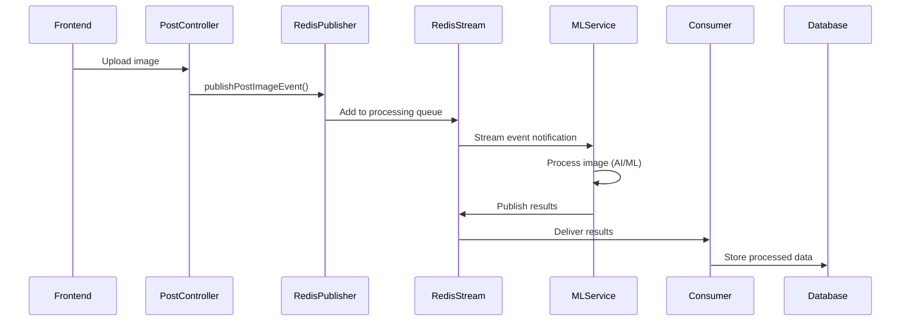

# Kaleidoscope Machine Learning Pipeline Documentation

## Overview
The Kaleidoscope ML Pipeline is an event-driven, asynchronous machine learning processing system built on Redis Streams. It handles computer vision tasks including face detection, face recognition, and media AI insights processing for uploaded images and profile pictures.

## Architecture Components

### Core Technologies
- **Redis Streams**: Event-driven messaging for ML processing
- **Spring Data Redis**: Redis integration with Spring Boot
- **Jackson**: JSON serialization/deserialization
- **PostgreSQL**: Storing ML results and metadata
- **Consumer Groups**: Reliable message processing with load balancing

### System Architecture

```
┌─────────────────┐    ┌──────────────────┐    ┌─────────────────────┐
│   Frontend      │    │   Backend API    │    │   ML Service       │
│   (Image Upload)│───▶│   (Event Pub)    │───▶│   (Python/AI)      │
└─────────────────┘    └──────────────────┘    └─────────────────────┘
                                │                          │
                                ▼                          │
                       ┌──────────────────┐                │
                       │  Redis Streams   │◀───────────────┘
                       │  - ml-insights   │
                       │  - face-detect   │
                       │  - face-recog    │
                       └──────────────────┘
                                │
                                ▼
                       ┌──────────────────┐
                       │  Stream Consumers│
                       │  - MediaAI       │
                       │  - FaceDetection │
                       │  - FaceRecognition│
                       └──────────────────┘
                                │
                                ▼
                       ┌──────────────────┐
                       │   PostgreSQL     │
                       └──────────────────┘
```

## Component Structure

```
ml/
├── config/
│   ├── RedisConfig.java              # Redis connection configuration
│   ├── RedisStreamConfig.java        # Stream listeners and consumer groups
│   └── RedisStreamConstants.java     # Stream names and constants
├── consumer/
│   ├── FaceDetectionConsumer.java    # Processes face detection results
│   ├── FaceRecognitionConsumer.java  # Processes face recognition results
│   └── MediaAiInsightsConsumer.java  # Processes general AI insights
├── dto/
│   ├── FaceDetectionResultDTO.java   # Face detection data structure
│   ├── FaceRecognitionResultDTO.java # Face recognition data structure
│   ├── MediaAiInsightsResultDTO.java # AI insights data structure
│   ├── PostImageEventDTO.java        # Post image processing event
│   └── ProfilePictureEventDTO.java   # Profile picture processing event
└── service/
    └── RedisStreamPublisher.java     # Publishes events to ML service
```

## Redis Streams Architecture

### Stream Configuration
The system uses three primary Redis Streams:

1. **ml-insights-results**: General AI insights (objects, scenes, colors, etc.)
2. **face-detection-results**: Face detection bounding boxes and metadata
3. **face-recognition-results**: Face recognition and identity matching

### Consumer Group Setup
- Consumer group: "backend-group"
- Consumers:
  - media-ai-consumer (ML insights)
  - face-detection-consumer (Face detection)
  - face-recognition-consumer (Face recognition)

### Stream Processing Flow



## Event Publishing

### RedisStreamPublisher Service
Publishes events for ML processing:

- publishPostImageEvent(PostImageEventDTO event)
- publishProfilePictureEvent(ProfilePictureEventDTO event)

### Event Data Structures

#### PostImageEventDTO
```json
{
    "postId": "12345",
    "mediaId": "67890", 
    "imageUrl": "https://storage.../image.jpg",
    "userId": "user123",
    "timestamp": "2025-09-29T10:30:00Z"
}
```

#### ProfilePictureEventDTO
```json
{
    "userId": "user123",
    "imageUrl": "https://storage.../profile.jpg",
    "timestamp": "2025-09-29T10:30:00Z"
}
```

## Stream Consumers

### 1. MediaAiInsightsConsumer
**Purpose**: Processes general AI insights about images

**Processed Data**:
- Object detection (people, animals, objects)
- Scene recognition (indoor/outdoor, location type)
- Color analysis (dominant colors, color palette)
- Image quality metrics
- Content moderation flags

**Database Storage**:
- Updates `MediaAiInsights` entity

### 2. FaceDetectionConsumer
**Purpose**: Processes face detection results

**Processed Data**:
- Face bounding boxes (x, y, width, height)
- Face confidence scores
- Face attributes (age estimation, gender, emotions)
- Face quality metrics

**Database Storage**:
- Stores in `MediaDetectedFace` entity
- Links faces to media and posts
- Updates face detection status

### 3. FaceRecognitionConsumer
**Purpose**: Processes face recognition and identity matching

**Processed Data**:
- Face embeddings/features
- Identity matches with existing faces
- Confidence scores for matches
- Face clustering results

**Database Storage**:
- Updates face recognition data
- Links recognized faces to user profiles

## Error Handling and Reliability

### Consumer Group Benefits
- **Load Balancing**: Multiple consumer instances can process streams
- **Fault Tolerance**: Messages persist until acknowledged
- **Replay Capability**: Can reprocess messages from specific points

### Error Handling Strategy
The system uses custom error handlers for processing failures and provides logging for troubleshooting.

## Data Models

### MediaAiInsights Entity
```java
@Entity
public class MediaAiInsights {
    private Long id;
    private String mediaId;
    private List<String> detectedObjects;    // Objects found in image
    private List<String> scenes;             // Scene classification
    private List<String> colors;             // Dominant colors
    private Double qualityScore;             // Image quality (0-1)
    private Boolean hasAdultContent;         // Content moderation
    private Boolean hasViolentContent;
    private Instant processedAt;
}
```

### MediaDetectedFace Entity
```java
@Entity  
public class MediaDetectedFace {
    private Long id;
    private String mediaId;
    private Double boundingBoxX;             // Face location
    private Double boundingBoxY;
    private Double boundingBoxWidth;
    private Double boundingBoxHeight;
    private Double confidence;               // Detection confidence
    private Integer estimatedAge;            // Age estimation
    private String estimatedGender;          // Gender estimation
    private String dominantEmotion;          // Emotion detection
    private FaceDetectionStatus status;      // Processing status
}
```

## Configuration

### Redis Stream Configuration
```yaml
spring:
  redis:
    host: ${REDIS_HOST:localhost}
    port: ${REDIS_PORT:6379}
    password: ${REDIS_PASSWORD:}
    
kaleidoscope:
  ml:
    streams:
      insights: "ml-insights-results"
      face-detection: "face-detection-results" 
      face-recognition: "face-recognition-results"
    consumer-group: "backend-group"
```

## Monitoring and Observability

### Logging Strategy
The system provides structured logging for ML processing events with correlation IDs for request tracking.

### Key Metrics
- **Messages Processed**: Total processed per stream
- **Processing Latency**: Time from event to completion
- **Error Rate**: Failed processing percentage
- **Queue Depth**: Pending messages in streams

## Integration Points

### With Posts System
- Post image uploads trigger ML processing
- ML results enhance post searchability
- Face detection enables auto-tagging
- Content moderation protects platform

### With User System  
- Profile picture processing for face recognition
- Face-based user suggestions
- Privacy controls for face recognition

## External ML Service Integration

The backend publishes events to Redis Streams that are consumed by external ML services (typically Python-based). The ML services process the images and publish results back to the result streams that this backend consumes.

### ML Service Requirements
- Must consume from image processing streams
- Must publish results to result streams  
- Must handle error cases gracefully
- Must respect data privacy requirements

This ML pipeline documentation covers the event-driven machine learning architecture that powers Kaleidoscope's computer vision features.
