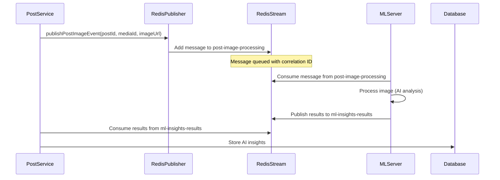
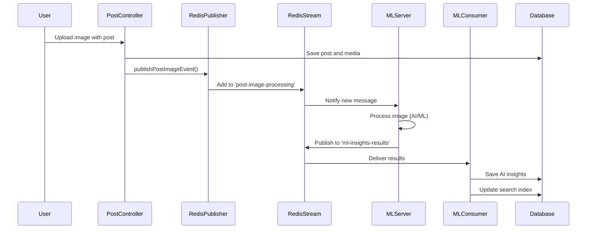
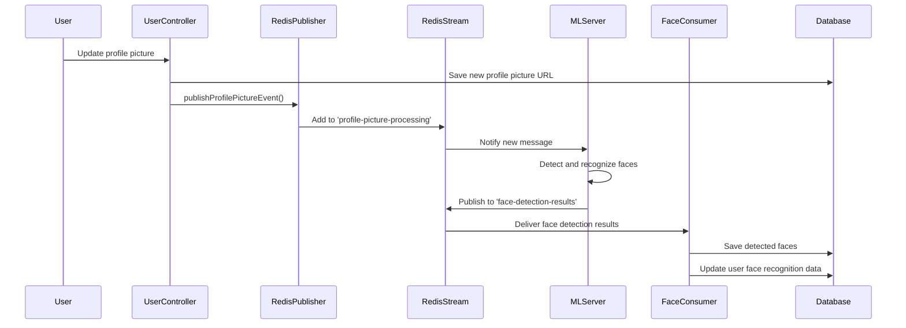

# Kaleidoscope ML Server Integration via Redis Streams

## Overview
The Kaleidoscope backend integrates with external ML services through Redis Streams using a producer-consumer pattern. This asynchronous architecture allows the backend to publish image processing requests and consume ML results without blocking operations, ensuring scalability and reliability.

## Architecture Design

### Communication Pattern
```
┌─────────────────┐    Redis Streams    ┌─────────────────┐
│  Backend API    │ ═══════════════════▶ │   ML Server     │
│  (Producer)     │                      │  (Consumer)     │
└─────────────────┘                      └─────────────────┘
         ▲                                        │
         │              Redis Streams             │
         │ ◀═══════════════════════════════════════┘
         ▼
┌─────────────────┐
│  Backend API    │
│  (Consumer)     │
└─────────────────┘
```

### Stream Architecture
The system uses **bidirectional Redis Streams**:

**Outbound Streams** (Backend → ML Server):
- `profile-picture-processing` - Profile picture analysis requests  
- `post-image-processing` - Post image analysis requests
- `post-update-processing` - Post update requests

**Inbound Streams** (ML Server → Backend):
- `ml-insights-results` - General AI insights results
- `face-detection-results` - Face detection results  
- `face-recognition-results` - Face recognition results

## Producer Implementation (Backend → ML Server)

### RedisStreamPublisher Service
The backend publishes events to ML server using the `RedisStreamPublisher`:

```java
@Service
@RequiredArgsConstructor
@Slf4j
public class RedisStreamPublisher {
    private final StringRedisTemplate stringRedisTemplate;
    private final ObjectMapper objectMapper;
    
    // Critical streams that require guaranteed delivery
    private static final Set<String> CRITICAL_STREAMS = Set.of(
        "media-ai-insights", "face-detection", "face-recognition"
    );
    
    public void publish(String streamName, Object eventDto) {
        // Convert DTO to Map and publish to Redis Stream
        Map<String, String> messagePayload = objectMapper.convertValue(eventDto, Map.class);
        MapRecord<String, String, String> record = MapRecord.create(streamName, messagePayload);
        String messageId = stringRedisTemplate.opsForStream().add(record).getValue();
    }
}
```

### Event DTOs for ML Processing

#### PostImageEventDTO
Published when a post image needs ML processing:
```java
@Data
@Builder
public class PostImageEventDTO {
    private Long postId;          // Post identifier
    private Long mediaId;         // Media identifier  
    private String imageUrl;      // Image location for ML processing
    private String correlationId; // Request tracing ID
}
```

#### ProfilePictureEventDTO  
Published when a profile picture needs ML processing:
```java
@Data
@Builder
public class ProfilePictureEventDTO {
    private Long userId;          // User identifier
    private String imageUrl;      // Profile image location
    private String correlationId; // Request tracing ID
}
```

### Stream Constants
Stream names are centralized in `RedisStreamConstants`:
```java
public final class RedisStreamConstants {
    public static final String PROFILE_PICTURE_PROCESSING_STREAM = "profile-picture-processing";
    public static final String POST_IMAGE_PROCESSING_STREAM = "post-image-processing";
    public static final String POST_UPDATE_STREAM = "post-update-processing";
}
```

### Publishing Workflow


### Event Publishing Examples

#### Post Image Processing
When a new post with media is created:

```java
@Service
@RequiredArgsConstructor
@Slf4j
public class PostService {
    private final RedisStreamPublisher redisStreamPublisher;
    
    public Post createPost(CreatePostDto dto, User author) {
        Post post = postRepository.save(createPostEntity(dto, author));
        
        // Publish media for AI processing
        post.getMedia().forEach(media -> {
            PostImageEventDTO event = PostImageEventDTO.builder()
                .postId(post.getPostId())
                .mediaId(media.getMediaId())
                .imageUrl(media.getFileUrl())
                .correlationId(MDC.get("correlationId"))
                .build();
                
            redisStreamPublisher.publish(
                RedisStreamConstants.POST_IMAGE_PROCESSING_STREAM, 
                event
            );
            
            log.info("Published post image for ML processing - postId: {}, mediaId: {}", 
                    post.getPostId(), media.getMediaId());
        });
        
        return post;
    }
}
```

#### Profile Picture Processing
When a user updates their profile picture:

```java
@Service
@RequiredArgsConstructor
@Slf4j
public class UserService {
    private final RedisStreamPublisher redisStreamPublisher;
    
    public User updateProfilePicture(Long userId, String imageUrl) {
        User user = userRepository.findById(userId)
            .orElseThrow(() -> new UserNotFoundException("User not found"));
            
        user.setProfilePictureUrl(imageUrl);
        User savedUser = userRepository.save(user);
        
        // Publish for ML processing
        ProfilePictureEventDTO event = ProfilePictureEventDTO.builder()
            .userId(userId)
            .imageUrl(imageUrl)
            .correlationId(MDC.get("correlationId"))
            .build();
            
        redisStreamPublisher.publish(
            RedisStreamConstants.PROFILE_PICTURE_PROCESSING_STREAM,
            event
        );
        
        log.info("Published profile picture for ML processing - userId: {}", userId);
        
        return savedUser;
    }
}
```

## Consumer Implementation (ML Server → Backend)

### Stream Consumer Configuration
The backend consumes ML results through configured stream listeners:

```java
@Configuration
public class RedisStreamConfig {
    
    // Stream names for ML results
    private static final String ML_INSIGHTS_STREAM = "ml-insights-results";
    private static final String FACE_DETECTION_STREAM = "face-detection-results";
    private static final String FACE_RECOGNITION_STREAM = "face-recognition-results";
    
    // Consumer group
    private static final String CONSUMER_GROUP = "backend-group";
    
    @Bean
    public StreamMessageListenerContainer streamMessageListenerContainer() {
        // Configure container with consumers
        container.receive(
            Consumer.from(CONSUMER_GROUP, "media-ai-consumer"),
            StreamOffset.create(ML_INSIGHTS_STREAM, ReadOffset.latest()),
            mediaAiInsightsConsumer
        );
        // ... other consumers
    }
}
```

### Consumer Services

#### 1. MediaAiInsightsConsumer
Processes general AI insights from ML server:

```java
@Service
@RequiredArgsConstructor  
@Slf4j
public class MediaAiInsightsConsumer implements StreamListener<String, MapRecord<String, String, String>> {
    
    @Override
    @Transactional
    public void onMessage(MapRecord<String, String, String> record) {
        // 1. Deserialize incoming message
        MediaAiInsightsResultDTO resultDTO = convertMapRecordToDTO(record);
        
        // 2. Find associated PostMedia
        PostMedia postMedia = postMediaRepository.findById(resultDTO.getMediaId())
            .orElseThrow(() -> new RuntimeException("PostMedia not found"));
            
        // 3. Save AI insights to database
        MediaAiInsights insights = createOrUpdateInsights(postMedia, resultDTO);
        mediaAiInsightsRepository.save(insights);
        
        // 4. Index for search capabilities
        updateSearchIndex(postMedia, insights);
    }
}
```

#### 2. FaceDetectionConsumer
Processes face detection results:

```java
@Service
@RequiredArgsConstructor
@Slf4j  
public class FaceDetectionConsumer implements StreamListener<String, MapRecord<String, String, String>> {
    
    @Override
    @Transactional
    public void onMessage(MapRecord<String, String, String> record) {
        // 1. Deserialize face detection results
        FaceDetectionResultDTO resultDTO = convertMapRecordToDTO(record);
        
        // 2. Save detected faces to database  
        List<MediaDetectedFace> detectedFaces = createDetectedFaces(resultDTO);
        mediaDetectedFaceRepository.saveAll(detectedFaces);
        
        // 3. Update face detection status
        updateFaceDetectionStatus(resultDTO.getMediaId(), FaceDetectionStatus.COMPLETED);
    }
}
```

#### 3. FaceRecognitionConsumer
Processes face recognition results:

```java
@Service
@RequiredArgsConstructor
@Slf4j
public class FaceRecognitionConsumer implements StreamListener<String, MapRecord<String, String, String>> {
    
    @Override  
@Transactional
    public void onMessage(MapRecord<String, String, String> record) {
        // 1. Deserialize face recognition results
        FaceRecognitionResultDTO resultDTO = convertMapRecordToDTO(record);
        
        // 2. Update face recognition data
        updateFaceRecognitionData(resultDTO);
        
        // 3. Link recognized faces to user profiles
        linkFacesToUsers(resultDTO);
    }
}
```

### Result DTOs from ML Server

#### MediaAiInsightsResultDTO
```java
@Data
@Builder
public class MediaAiInsightsResultDTO {
    private Long mediaId;
    private List<String> detectedObjects;    // ["person", "car", "tree"]
    private List<String> scenes;             // ["outdoor", "urban"]  
    private List<String> colors;             // ["blue", "green", "red"]
    private Double qualityScore;             // 0.0 to 1.0
    private Boolean hasAdultContent;         // Content moderation
    private Boolean hasViolentContent;       // Violence detection
    private String dominantEmotion;          // "happy", "sad", etc.
    private String correlationId;            // Request tracking
}
```

#### FaceDetectionResultDTO
```java
@Data
@Builder
public class FaceDetectionResultDTO {
    private Long mediaId;
    private List<DetectedFace> faces;        // Face bounding boxes
    private String correlationId;
    
    @Data
    @Builder
    public static class DetectedFace {
        private Double boundingBoxX;         // Face location
        private Double boundingBoxY;
        private Double boundingBoxWidth;
        private Double boundingBoxHeight;
        private Double confidence;           // Detection confidence 0-1
        private Integer estimatedAge;        // Age estimation
        private String estimatedGender;      // Gender estimation  
        private String dominantEmotion;      // Primary emotion
    }
}
```

## Consumer Group Benefits

### Reliability Features
- **Message Persistence**: Messages remain in stream until acknowledged
- **Consumer Groups**: Multiple backend instances can process messages
- **Load Balancing**: Messages distributed across group members
- **Failure Handling**: Failed messages can be retried or moved to dead letter queue

### Consumer Group Configuration
```java
// Consumer group: "backend-group"
// Individual consumers:
// - "media-ai-consumer" → MediaAiInsightsConsumer  
// - "face-detection-consumer" → FaceDetectionConsumer
// - "face-recognition-consumer" → FaceRecognitionConsumer
```

## Error Handling & Reliability

### Producer Error Handling
```java
public class RedisStreamPublisher {
    
    public void publish(String streamName, Object eventDto) {
        try {
            // Publish message
            MapRecord<String, String, String> record = MapRecord.create(streamName, messagePayload);
            String messageId = stringRedisTemplate.opsForStream().add(record).getValue();
            log.info("Published message: streamName={}, messageId={}", streamName, messageId);
        } catch (Exception e) {
            log.error("Failed to publish to stream '{}': {}", streamName, e.getMessage(), e);
            
            // Critical streams require guaranteed delivery
            if (CRITICAL_STREAMS.contains(streamName)) {
                throw new RuntimeException("Failed to publish critical event", e);
            }
        }
    }
    
    // Retry mechanism for critical messages
    public void publishWithRetry(String streamName, Object eventDto, int maxRetries) {
        int attempts = 0;
        while (attempts < maxRetries) {
            try {
                publish(streamName, eventDto);
                return; // Success
            } catch (Exception e) {
                attempts++;
                if (attempts >= maxRetries) {
                    log.error("Failed after {} attempts: stream='{}', error={}", 
                             maxRetries, streamName, e.getMessage());
                    throw e;
                }
                
                // Exponential backoff
                Thread.sleep(1000L * attempts);
            }
        }
    }
}
```

### Consumer Error Handling
```java
@Override
@Transactional
public void onMessage(MapRecord<String, String, String> record) {
    try {
        // Process ML result
        processMLResult(record);
        
        // Acknowledge message (automatic with Spring Data Redis)
        log.info("Successfully processed message: messageId={}", record.getId());
        
    } catch (DataIntegrityViolationException e) {
        log.error("Database constraint violation: messageId={}, error={}", 
                 record.getId(), e.getMessage());
        // Message will be retried by consumer group
        
    } catch (Exception e) {
        log.error("Unexpected error processing message: messageId={}, error={}", 
                 record.getId(), e.getMessage(), e);
        // Could implement dead letter queue logic here
        throw e; // Rethrow to trigger retry
    }
}
```

## ML Server Requirements

### For External ML Service Implementation
The external ML server must implement the following contract:

#### 1. Consume Processing Requests
```python
# Python example for ML server
import redis
import json

redis_client = redis.Redis(host='localhost', port=6379, decode_responses=True)

# Consume from processing streams
streams = {
    'profile-picture-processing': '0',
    'post-image-processing': '0',  
    'post-update-processing': '0'
}

while True:
    messages = redis_client.xread(streams, block=1000, count=1)
    for stream_name, stream_messages in messages:
        for message_id, fields in stream_messages:
            process_image_request(stream_name, message_id, fields)
```

#### 2. Publish Processing Results
```python
def publish_ml_results(result_stream, result_data):
    """Publish ML processing results back to backend"""
    redis_client.xadd(result_stream, result_data)
    
# Example usage
ml_insights = {
    'mediaId': '12345',
    'detectedObjects': json.dumps(['person', 'car']),
    'scenes': json.dumps(['outdoor']),
    'qualityScore': '0.85',
    'correlationId': 'req-123'
}
publish_ml_results('ml-insights-results', ml_insights)
```

#### 3. Handle Processing Errors
```python
def handle_processing_error(correlation_id, error_message):
    """Handle ML processing failures"""
    error_result = {
        'correlationId': correlation_id,
        'error': error_message,
        'status': 'FAILED'
    }
    redis_client.xadd('ml-error-results', error_result)
```

## Data Flow Examples

### Complete Post Image Processing Flow


### Profile Picture Processing Flow


## Configuration

### Redis Configuration
```yaml
spring:
  redis:
    host: ${REDIS_HOST:localhost}
    port: ${REDIS_PORT:6379}
    password: ${REDIS_PASSWORD:}
    timeout: 60000
    lettuce:
      pool:
        max-active: 10
        max-idle: 5
        min-idle: 1

kaleidoscope:
  ml:
    streams:
      # Outbound streams (Backend → ML Server)
      profile-picture-processing: "profile-picture-processing"
      post-image-processing: "post-image-processing"
      post-update-processing: "post-update-processing"
      
      # Inbound streams (ML Server → Backend)  
      ml-insights-results: "ml-insights-results"
      face-detection-results: "face-detection-results"
      face-recognition-results: "face-recognition-results"
      
    consumer-group: "backend-group"
    batch-size: 10
    poll-timeout: 1000
```

### Environment Variables
```bash
# Redis connection
REDIS_HOST=localhost
REDIS_PORT=6379
REDIS_PASSWORD=your_redis_password

# ML processing configuration
ML_PROCESSING_ENABLED=true
ML_RETRY_ATTEMPTS=3
ML_TIMEOUT_SECONDS=30
```

## Monitoring & Troubleshooting

### Key Metrics to Monitor
```bash
# Stream lengths (pending messages)
redis-cli XLEN post-image-processing
redis-cli XLEN ml-insights-results

# Consumer group info
redis-cli XINFO GROUPS post-image-processing
redis-cli XINFO CONSUMERS post-image-processing backend-group

# Pending messages
redis-cli XPENDING ml-insights-results backend-group
```

### Common Issues & Solutions

#### High Stream Length
```bash
# Check if ML server is consuming messages
redis-cli XINFO CONSUMERS post-image-processing backend-group

# Manual message processing for debugging
redis-cli XREAD STREAMS post-image-processing 0
```

#### Consumer Lag
```bash
# Check consumer processing status
redis-cli XINFO GROUPS ml-insights-results

# Reset consumer position (use carefully)
redis-cli XGROUP SETID ml-insights-results backend-group $
```

#### Message Processing Failures
```bash
# Check failed messages
redis-cli XPENDING ml-insights-results backend-group - + 10

# Claim stuck messages for reprocessing
redis-cli XCLAIM ml-insights-results backend-group consumer1 60000 message-id
```

This Redis Streams implementation provides a robust, scalable, and reliable communication mechanism between the Kaleidoscope backend and external ML services, ensuring efficient processing of image analysis requests and results.
