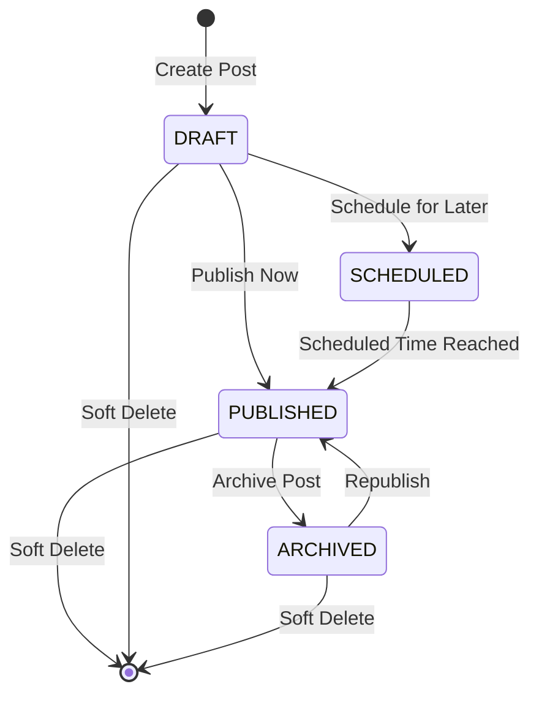
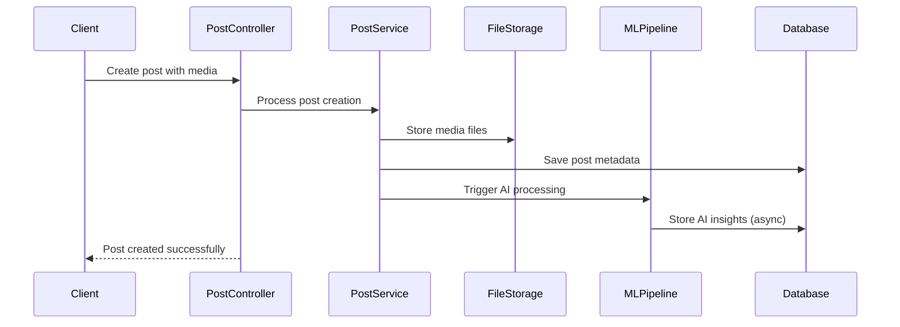

# Kaleidoscope Posts Management System Documentation

## Overview
The Kaleidoscope Posts Management System handles photo posts with media processing, AI-powered insights, and basic user interactions. It integrates with the ML pipeline for automated content analysis and provides search capabilities.

## Architecture Components

### Core Technologies
- **Spring Data JPA**: Entity relationship management
- **PostgreSQL**: Primary data storage
- **AI Integration**: ML pipeline for media insights
- **Soft Delete**: Audit-friendly deletion strategy
- **File Upload**: Media attachment handling

### System Architecture

```
┌─────────────────┐    ┌──────────────────┐    ┌─────────────────────┐
│   Frontend      │    │   Posts API      │    │   ML Pipeline       │
│   (Create Post) │───▶│   Controller     │───▶│   (Media AI)        │
└─────────────────┘    └──────────────────┘    └─────────────────────┘
                                │                          │
                                ▼                          ▼
                       ┌───────────���──────┐    ┌─────────────────────┐
                       │   Posts Service  │    │   AI Insights       │
                       │   - CRUD Ops     │    │   - Face Detection  │
                       │   - Media Mgmt   │    │   - Object Recog    │
                       └──────────────────┘    └─────────────────────┘
                                │                          │
                                ▼                          │
                       ┌──────────────────┐                │
                       │   PostgreSQL     │◀───────────────┘
                       │   - Posts        │
                       │   - Media        │
                       │   - AI Insights  │
                       └──────────────────┘
```

## Component Structure

```
posts/
├── controller/
│   ├── PostController.java              # Main posts CRUD operations
│   ├── PostInteractionController.java   # Post interactions (if implemented)
│   └── api/                            # OpenAPI interface definitions
├── document/
│   ├── PostDocument.java              # Elasticsearch post document
│   ├── MediaSearchDocument.java       # Media search indexing
│   ├── MediaAiInsightsDocument.java   # AI insights for search
│   └── MediaDetectedFaceDocument.java  # Face detection search
├── dto/
│   ├── request/                        # Post creation/update requests
│   └── response/                       # Post response formats
├── enums/
│   ├── PostStatus.java                # DRAFT, PUBLISHED, ARCHIVED
│   ├── PostVisibility.java            # PUBLIC, PRIVATE, FRIENDS_ONLY
│   └── MediaType.java                 # IMAGE, VIDEO, AUDIO
├── exception/
│   └── posts/                         # Post-specific exceptions
├── mapper/
│   └── PostMapper.java               # Entity-DTO mapping
├── model/
│   ├── Post.java                     # Main post entity
│   ├── PostMedia.java               # Media attachments
│   ├── PostCategory.java            # Post categorization
│   ├── PostSave.java                # Saved posts functionality
│   ├── MediaAiInsights.java         # AI processing results
│   └── MediaDetectedFace.java       # Face detection data
├── repository/
│   ├── PostRepository.java          # Post data access
│   ├── PostMediaRepository.java     # Media queries
│   └── specification/               # Dynamic query building
├── routes/
│   └── PostsRoutes.java            # Route constants
└── service/
    ├── PostService.java            # Main business logic
    └── impl/                       # Service implementations
```

## Core Data Models

### Post Entity
The central entity representing a user's post:

```java
@Entity
public class Post {
    private Long postId;
    private User user;                    // Post author
    private String title;                 // Post title (max 200 chars)
    private String body;                  // Post content (TEXT)
    private String summary;               // Brief summary (max 500 chars)
    private Location location;            // Geographic location
    private PostVisibility visibility;    // PUBLIC, PRIVATE, FRIENDS_ONLY
    private PostStatus status;            // DRAFT, PUBLISHED, ARCHIVED
    private LocalDateTime scheduledAt;    // Scheduled publishing time
    private LocalDateTime deletedAt;      // Soft delete timestamp
    private Set<PostMedia> media;         // Attached media files
    private Set<UserTag> userTags;        // Tagged users
    private Set<Category> categories;     // Content categories
}
```

### PostMedia Entity
Manages media attachments with AI processing:

```java
@Entity
public class PostMedia {
    private Long mediaId;
    private Post post;                    // Parent post
    private String fileName;              // Original filename
    private String fileUrl;               // Storage URL
    private String thumbnailUrl;          // Thumbnail URL
    private MediaType mediaType;          // IMAGE, VIDEO, AUDIO
    private Long fileSize;                // File size in bytes
    private String mimeType;              // MIME type
    private Integer displayOrder;         // Media ordering
    private MediaAiInsights aiInsights;   // AI processing results
    private Set<MediaDetectedFace> detectedFaces; // Face detection
}
```

### MediaAiInsights Entity
AI processing results for enhanced search:

```java
@Entity
public class MediaAiInsights {
    private Long insightId;
    private PostMedia media;              // Associated media
    private List<String> detectedObjects; // Objects in image
    private List<String> scenes;          // Scene classification
    private List<String> colors;          // Dominant colors
    private Double qualityScore;          // Image quality (0-1)
    private Boolean hasAdultContent;      // Content moderation
    private Boolean hasViolentContent;    // Violence detection
    private String dominantEmotion;       // Emotion in image
    private LocalDateTime processedAt;    // Processing timestamp
}
```

## Post Lifecycle Management

### Post Status Flow


### Visibility Control
- **PUBLIC**: Visible to all users
- **PRIVATE**: Visible only to post author
- **FRIENDS_ONLY**: Visible to friends/followers only

## Media Processing Pipeline

### Upload Flow


### AI Processing Integration
1. **Image Upload**: Original image stored in file system/cloud
2. **ML Event Publishing**: Event sent to ML pipeline via Redis Streams
3. **AI Processing**: External ML service processes image
4. **Results Storage**: AI insights stored in database

## API Endpoints Reference

### Post Management
- `GET /api/posts` - Get posts with filtering/pagination
- `GET /api/posts/{id}` - Get specific post
- `POST /api/posts` - Create new post
- `PUT /api/posts/{id}` - Update post
- `DELETE /api/posts/{id}` - Soft delete post

### Media Management
- `POST /api/posts/generate-upload-signature` - Generate upload signature for media
- Media upload handled through generated signatures

### Filtering and Search
The system supports filtering posts by:
- User ID
- Category ID
- Post Status
- Post Visibility
- Search query (text search across title, summary, body)
- **Hashtag** (filter by specific hashtag)
- Location ID (exact location match)
- Nearby Location (geo-distance search within radius)

**Search Implementation:** Uses Elasticsearch for high-performance filtering and full-text search

**Hashtag Filtering Example:**
```http
GET /api/posts?hashtag=travel&page=0&size=20
```

**Combined Filtering Example:**
```http
GET /api/posts?userId=123&categoryId=5&hashtag=photography&q=sunset&page=0&size=20
```

### Post Feed and Suggestions
The system provides intelligent post suggestions using Elasticsearch function_score queries:

**Endpoint:** `GET /api/posts/suggestions`

**Scoring Factors (in order of priority):**
1. **Following Boost (10.0x)** - Posts from followed users
2. **Interest Boost (5.0x)** - Posts matching user's interests
3. **Trending Hashtag Boost (3.0x)** - Posts with trending hashtags ⭐ NEW
4. **Popularity Boost (2.0x)** - Posts with high reaction counts
5. **Engagement Boost (1.5x)** - Posts with high comment counts
6. **View Count Boost (1.0x)** - Posts with high view counts

**Filtering:**
- Excludes user's own posts
- Excludes posts from blocked users
- Excludes recently viewed posts (tracked in Redis for 7 days)
- Only shows PUBLISHED posts
- Respects visibility settings (PUBLIC/FOLLOWERS)

**See:** [POST_SUGGESTION_SYSTEM.md](./POST_SUGGESTION_SYSTEM.md) for detailed algorithm documentation

## Post Categories

### PostCategory Entity
Posts can be categorized using the category system:

```java
@Entity
public class PostCategory {
    private Long postCategoryId;
    private Post post;                    // Associated post
    private Category category;            // Category reference
    private LocalDateTime assignedAt;     // When category was assigned
}
```

## Hashtag Integration ⭐ NEW

### Overview
Posts automatically extract and associate hashtags from post body content. Hashtags are used for:
- Post filtering and search
- Trending content discovery
- Intelligent content boosting in suggestions feed

### Hashtag Association
When a post is created or updated:
1. **Parsing**: Hashtags are automatically extracted from post body (e.g., `#travel`, `#photography`)
2. **Creation**: New hashtags are created in database, existing ones are reused
3. **Association**: Post-hashtag relationships stored in junction table
4. **Indexing**: Hashtag names synchronized to Elasticsearch for fast searching
5. **Usage Tracking**: Hashtag usage counts updated asynchronously via Redis Streams

### PostHashtag Junction Entity
```java
@Entity
public class PostHashtag {
    private PostHashtagId id;             // Composite key (postId, hashtagId)
    private Post post;                    // The post
    private Hashtag hashtag;              // The hashtag
    private LocalDateTime createdAt;      // Association timestamp
}
```

### Hashtag Features
- **Automatic Parsing**: Hashtags detected with `#` prefix (e.g., `#nature`, `#travel2024`)
- **Case Insensitive**: `#Travel` and `#travel` are treated as same hashtag
- **Usage Tracking**: Each hashtag maintains a usage count for trending analysis
- **Fast Search**: Indexed in Elasticsearch for O(1) lookup performance
- **Trending Discovery**: Top hashtags by usage count exposed via API

### API Endpoints
```http
# Filter posts by hashtag
GET /api/posts?hashtag=travel

# Get trending hashtags
GET /api/hashtags/trending?page=0&size=10

# Search hashtags by prefix
GET /api/hashtags/suggestions?prefix=trav
```

**See:** [HASHTAG_SYSTEM.md](./HASHTAG_SYSTEM.md) for comprehensive hashtag documentation
