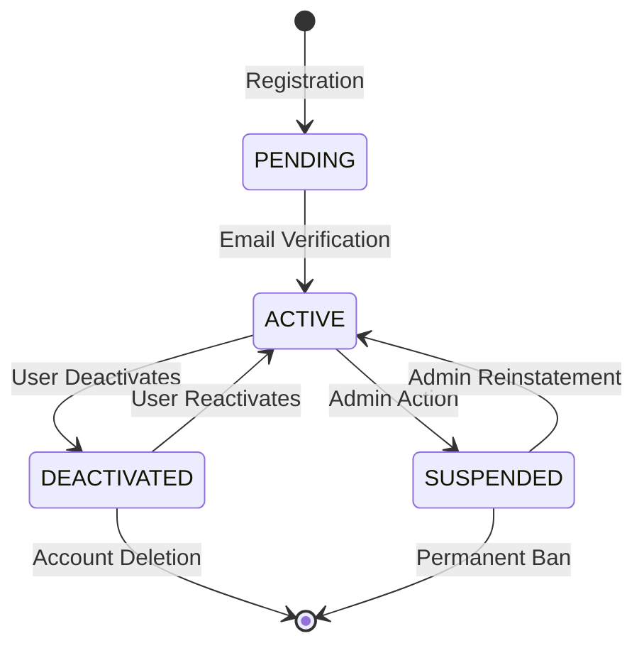

# Kaleidoscope User Management System Documentation

## Overview
The Kaleidoscope User Management System provides comprehensive user profile management, preferences, interests, social features (following, blocking), and notification controls. It integrates seamlessly with the authentication system and supports advanced user discovery and social networking features.

## Architecture Components

### Core Technologies
- **Spring Data JPA**: User entity management and relationships
- **File Upload Management**: Profile pictures and cover photos
- **Social Graph**: Following/follower relationships
- **Interest-based Recommendations**: Category-based user interests
- **Privacy Controls**: Granular privacy and notification preferences
- **Account Status Management**: User lifecycle and verification

### System Architecture

```
┌─────────────────┐    ┌──────────────────┐    ┌─────────────────────┐
│   Frontend      │    │   User API       │    │   File Storage      │
│   (Profile Mgmt)│───▶│   Controller     │───▶│   (Images)          │
└─────────────────┘    └──────────────────┘    └─────────────────────┘
                                │                          
                                ▼                          
                       ┌──────────────────┐    ┌─────────────────────┐
                       │   User Service   │    │   Notification      │
                       │   - Profile CRUD │───▶│   Preferences       │
                       │   - Social Graph │    │   Management        │
                       │   - Interests    │    └─────────────────────┘
                       └──────────────────┘                
                                │                          
                                ▼                          
                       ┌──────────────────┐    ┌─────────────────────┐
                       │   PostgreSQL     │    │   Authentication    │
                       │   - Users        │◀───│   Integration       │
                       │   - Preferences  │    │   (Auth System)     │
                       │   - Interests    │    └─────────────────────┘
                       │   - Social Graph │                
                       └──────────────────┘                
```

## Component Structure

```
users/
├── controller/
│   ├── UserController.java              # Main user profile operations
│   ├── UserPreferencesController.java   # User preferences management
│   ├── UserInterestController.java      # Interest management
│   ├── UserBlockController.java         # User blocking features
│   ├── UserTaggingController.java       # User tagging in posts
│   └── api/                            # OpenAPI interface definitions
├── document/
│   └── UserSearchDocument.java         # Elasticsearch user indexing
├── dto/
│   ├── request/                        # User update/preference requests
│   └── response/                       # User profile responses
├── enums/
│   ├── Theme.java                      # UI theme preferences
│   ├── Language.java                   # Supported languages
│   ├── NotificationFrequency.java      # Notification timing
│   └── PrivacyLevel.java              # Privacy setting levels
├── exception/
│   └── user/                          # User-specific exceptions
├── mapper/
│   ├── UserMapper.java                # Entity-DTO mapping
│   └── UserPreferencesMapper.java     # Preferences mapping
├── model/
│   ├── User.java                      # Main user entity
│   ├── UserPreferences.java           # User preferences
│   ├── UserInterest.java             # User interests/categories
│   ├── UserNotificationPreferences.java # Notification settings
│   ├── UserBlock.java                # Blocking relationships
│   ├── UserFollowing.java            # Following relationships
│   └── UserTag.java                  # User tagging in content
├── repository/
│   ├── UserRepository.java           # User data access
│   ├── UserPreferencesRepository.java # Preferences queries
│   ├── UserInterestRepository.java    # Interest management
│   ├── UserBlockRepository.java      # Blocking queries
│   └── UserFollowingRepository.java  # Social graph queries
├── routes/
│   └── UserRoutes.java              # Route constants
└── service/
    ├── UserService.java             # Main user business logic
    ├── UserPreferencesService.java  # Preferences management
    ├── UserInterestService.java     # Interest management
    ├── UserSocialService.java       # Social features
    └── impl/                        # Service implementations
```

## Core Data Models

### User Entity
The central user profile entity:

```java
@Entity
public class User {
    private Long userId;
    private String email;                    // Unique email address
    private String password;                 // Encrypted password
    private String username;                 // Unique username
    private String profilePictureUrl;        // Profile image URL
    private String coverPhotoUrl;            // Cover photo URL
    private Role role;                       // USER, ADMIN, MODERATOR
    private String designation;              // Job title/role
    private String summary;                  // User bio/description
    private Boolean isVerified;              // Verification badge
    private LocalDateTime emailVerifiedAt;   // Email verification timestamp
    private AccountStatus accountStatus;     // ACTIVE, DEACTIVATED, SUSPENDED
    private LocalDateTime lastSeen;          // Last activity timestamp
    private Set<UserInterest> interests;     // User interests/categories
}
```

### UserPreferences Entity
Comprehensive user preferences management:

```java
@Entity
public class UserPreferences {
    private Long preferenceId;
    private User user;                       // Associated user
    private Theme theme;                     // LIGHT, DARK, AUTO
    private Language language;               // Preferred language
    private String timezone;                 // User timezone
    private Boolean profileVisibility;       // Public profile visibility
    private Boolean showEmail;               // Email visibility in profile
    private Boolean allowTagging;            // Allow others to tag user
    private Boolean showOnlineStatus;        // Show online/offline status
    private Boolean allowDirectMessages;     // Accept DMs from non-friends
    private PrivacyLevel postVisibility;     // Default post visibility
    private Boolean indexProfile;            // Allow search engine indexing
}
```

### UserNotificationPreferences Entity
Granular notification control:

```java
@Entity
public class UserNotificationPreferences {
    private Long notificationPreferenceId;
    private User user;                       // Associated user
    private Boolean emailNotifications;      // Email notifications enabled
    private Boolean pushNotifications;       // Push notifications enabled
    private Boolean likeNotifications;       // Notify on post likes
    private Boolean commentNotifications;    // Notify on comments
    private Boolean followNotifications;     // Notify on new followers
    private Boolean mentionNotifications;    // Notify on user mentions
    private Boolean messageNotifications;    // Notify on direct messages
    private NotificationFrequency frequency; // IMMEDIATE, DAILY, WEEKLY
    private LocalTime quietHoursStart;       // Do not disturb start time
    private LocalTime quietHoursEnd;         // Do not disturb end time
}
```

### UserInterest Entity
Category-based user interests for recommendations:

```java
@Entity
public class UserInterest {
    private Long userInterestId;
    private User user;                       // Associated user
    private Category category;               // Interest category
    private Integer interestLevel;           // Interest strength (1-10)
    private LocalDateTime addedAt;           // When interest was added
    private Boolean isActive;                // Interest is currently active
}
```

### Social Relationship Entities

#### UserFollowing Entity
```java
@Entity
public class UserFollowing {
    private Long followingId;
    private User follower;                   // User who follows
    private User following;                  // User being followed
    private LocalDateTime followedAt;        // When relationship started
    private Boolean notificationsEnabled;   // Notify on their posts
}
```

#### UserBlock Entity
```java
@Entity
public class UserBlock {
    private Long blockId;
    private User blocker;                    // User who blocks
    private User blocked;                    // User being blocked
    private LocalDateTime blockedAt;         // When block was created
    private String reason;                   // Optional block reason
}
```

## User Lifecycle Management

### Account Status Flow


### Account Status Types
- **PENDING**: Newly registered, awaiting email verification
- **ACTIVE**: Fully active account with all features
- **DEACTIVATED**: User-initiated temporary deactivation
- **SUSPENDED**: Admin-initiated suspension for violations

### Email Verification Integration
- Integrated with authentication system's email verification
- `emailVerifiedAt` timestamp tracks verification
- Unverified users have limited functionality

## Profile Management Features

### Profile Picture & Cover Photo
- **Upload Support**: Image upload with validation
- **Automatic Processing**: Thumbnail generation and optimization
- **File Storage**: Cloud storage integration
- **Privacy Controls**: Visibility settings for profile images

### Bio and Professional Information
- **Summary**: Rich text bio/description
- **Designation**: Professional title or role
- **Verification Badge**: Manual verification for notable users
- **Custom Fields**: Extensible profile information

### Privacy Controls
```java
// Privacy settings in UserPreferences
public class UserPreferences {
    private Boolean profileVisibility;       // Public profile access
    private Boolean showEmail;               // Email display in profile
    private Boolean allowTagging;            // User tagging permissions
    private Boolean showOnlineStatus;        // Online status visibility
    private Boolean allowDirectMessages;     // DM permissions
    private PrivacyLevel postVisibility;     // Default post privacy
    private Boolean indexProfile;            // Search engine indexing
}
```

## Social Features

### Following System
- **Asymmetric Following**: Users can follow without mutual consent
- **Following Feed**: Personalized content from followed users
- **Notification Options**: Optional notifications for followed users' activities
- **Follow Recommendations**: AI-powered user suggestions

### Blocking System
- **Complete Blocking**: Blocked users cannot see profile or content
- **Mutual Invisibility**: Blocker and blocked user invisible to each other
- **Content Filtering**: Blocked users' content filtered from feeds
- **Interaction Prevention**: Prevents all forms of interaction

### User Discovery
```java
// Search for users
@GetMapping("/users/search")
public ResponseEntity<PaginatedResponse<UserSearchResponseDTO>> searchUsers(
    @RequestParam String query,
    @RequestParam(defaultValue = "0") int page,
    @RequestParam(defaultValue = "20") int size);

// Get user recommendations
@GetMapping("/users/recommendations")
public ResponseEntity<List<UserRecommendationResponseDTO>> getUserRecommendations();

// Get mutual followers
@GetMapping("/users/{userId}/mutual-followers")
public ResponseEntity<List<UserSummaryResponseDTO>> getMutualFollowers(
    @PathVariable Long userId);
```

## Interest-Based Recommendations

### Interest Management
Users can select interests from predefined categories:
- **Technology**: Programming, AI, Gadgets
- **Photography**: Portraits, Landscapes, Street Photography
- **Travel**: Adventure, Culture, Food
- **Lifestyle**: Fitness, Fashion, Health
- **Arts**: Music, Design, Literature

### Interest-Based Features
- **Content Recommendations**: Posts matching user interests
- **User Suggestions**: Users with similar interests
- **Trending Topics**: Popular content in user's interest areas
- **Personalized Feed**: Algorithm considers user interests

### Interest Scoring
```java
public class UserInterest {
    private Integer interestLevel;           // 1-10 interest strength
    // Dynamic scoring based on:
    // - User engagement with category content
    // - Time spent viewing related posts
    // - Interaction frequency with category
    // - Explicit user rating
}
```

## Notification Preferences

### Notification Types
- **Email Notifications**: Important updates via email
- **Push Notifications**: Real-time mobile/browser notifications
- **In-App Notifications**: Notification center within application

### Granular Controls
```java
public class UserNotificationPreferences {
    private Boolean likeNotifications;       // Post likes
    private Boolean commentNotifications;    // Post comments
    private Boolean followNotifications;     // New followers
    private Boolean mentionNotifications;    // User mentions in posts
    private Boolean messageNotifications;    // Direct messages
    private NotificationFrequency frequency; // Batching frequency
    private LocalTime quietHoursStart;       // Do not disturb period
    private LocalTime quietHoursEnd;
}
```

### Smart Notification Features
- **Batching**: Group similar notifications
- **Quiet Hours**: Respect user's do-not-disturb times
- **Intelligent Filtering**: Reduce notification fatigue
- **Priority System**: Important notifications bypass filters

## User Search and Discovery

### Elasticsearch Integration
```java
@Document(indexName = "users")
public class UserSearchDocument {
    private String userId;
    private String username;
    private String email;                    // Searchable if public
    private String summary;                  // Bio content
    private String designation;              // Professional title
    private List<String> interests;          // User interest categories
    private Boolean isVerified;              // Verification status
    private LocalDateTime lastSeen;          // Activity recency
    private Long followerCount;              // Social proof
    private Double engagementScore;          // Activity level
}
```

### Search Features
- **Username Search**: Exact and partial username matching
- **Bio Search**: Full-text search in user summaries
- **Interest-Based Discovery**: Find users with similar interests
- **Location-Based Search**: Users in specific geographic areas
- **Verification Filter**: Filter by verified users
- **Activity Filter**: Find recently active users

## Privacy and Security

### Data Protection
- **GDPR Compliance**: Full user data export and deletion
- **Privacy by Design**: Default privacy-friendly settings
- **Data Minimization**: Only collect necessary information
- **Consent Management**: Explicit consent for data processing

### Security Features
```java
@PreAuthorize("@userSecurityService.canViewProfile(#userId, authentication.name)")
@GetMapping("/users/{userId}")
public ResponseEntity<UserProfileResponseDTO> getUserProfile(@PathVariable Long userId);

@PreAuthorize("@userSecurityService.canEditProfile(#userId, authentication.name)")
@PutMapping("/users/{userId}")
public ResponseEntity<UserProfileResponseDTO> updateUserProfile(
    @PathVariable Long userId, 
    @RequestBody UserUpdateRequestDTO request);
```

### Access Control
- **Profile Visibility**: Control who can view profile
- **Contact Information**: Hide sensitive data from public
- **Activity Privacy**: Control visibility of online status
- **Search Privacy**: Opt-out of search engine indexing

## API Endpoints Reference

### Profile Management
- `GET /api/users/{id}` - Get user profile
- `PUT /api/users/{id}` - Update user profile
- `POST /api/users/{id}/upload-profile-picture` - Upload profile picture
- `POST /api/users/{id}/upload-cover-photo` - Upload cover photo
- `GET /api/users/me` - Get current user profile

### Preferences Management
- `GET /api/users/{id}/preferences` - Get user preferences
- `PUT /api/users/{id}/preferences` - Update preferences
- `GET /api/users/{id}/notification-preferences` - Get notification settings
- `PUT /api/users/{id}/notification-preferences` - Update notifications

### Social Features
- `POST /api/users/{id}/follow` - Follow user
- `DELETE /api/users/{id}/follow` - Unfollow user
- `GET /api/users/{id}/followers` - Get followers list
- `GET /api/users/{id}/following` - Get following list
- `POST /api/users/{id}/block` - Block user
- `DELETE /api/users/{id}/block` - Unblock user

### Interest Management
- `GET /api/users/{id}/interests` - Get user interests
- `POST /api/users/{id}/interests` - Add interest
- `DELETE /api/users/{id}/interests/{interestId}` - Remove interest
- `GET /api/categories` - Get available interest categories

### Discovery and Search
- `GET /api/users/search` - Search users
- `GET /api/users/recommendations` - Get user recommendations
- `GET /api/users/trending` - Get trending/popular users

## Performance Optimization

### Caching Strategy
- **Profile Caching**: Cache frequently accessed profiles
- **Preferences Caching**: Cache user preferences for quick access
- **Social Graph Caching**: Cache follower/following relationships
- **Search Result Caching**: Cache popular search queries

### Database Optimization
- **Indexes**: Optimized queries for user search and discovery
- **Connection Pooling**: Efficient database connections
- **Read Replicas**: Separate read/write operations
- **Partitioning**: Large table partitioning by user ID

## Monitoring and Analytics

### Key Metrics
- **User Registration Rate**: New user signups over time
- **Profile Completion Rate**: Users with complete profiles
- **Social Graph Growth**: Following/follower relationship growth
- **Feature Adoption**: Usage of preferences and privacy features
- **Search Performance**: User discovery and search metrics

### User Analytics
- **Activity Tracking**: User engagement patterns
- **Feature Usage**: Most used profile features
- **Social Metrics**: Following patterns and relationship analysis
- **Content Preferences**: Interest-based behavior analysis

## Testing Strategy

### Unit Testing
- User service business logic
- Privacy control validation
- Interest management functionality
- Social relationship handling

### Integration Testing
- Profile API endpoints
- File upload functionality
- Search integration
- Notification preference updates

### Security Testing
- Access control validation
- Privacy setting enforcement
- Data protection compliance
- Authentication integration

## Future Enhancements

### Planned Features
- **Advanced User Analytics**: Detailed user behavior insights
- **Smart Recommendations**: ML-powered user and content suggestions
- **Advanced Privacy Controls**: Granular visibility settings
- **Social Features**: Groups, communities, events
- **Professional Networking**: LinkedIn-style professional features

### Technical Improvements
- **Real-time Status**: WebSocket integration for online status
- **Advanced Search**: Machine learning-enhanced user discovery
- **Mobile Optimization**: Mobile-specific features and APIs
- **Internationalization**: Multi-language support expansion

This comprehensive User Management System documentation covers all aspects of user profiles, preferences, social features, and privacy controls that power the Kaleidoscope platform's user experience.
